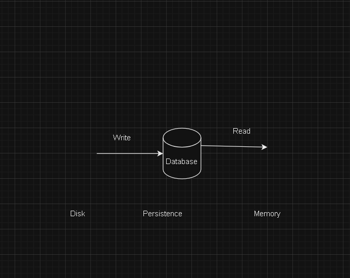

# Key Terms 

> Databases

 Database are program that either use disk or memory to do 2 core things:**record** data and **query** data. In general they are themselves servers that are long lived and interact with the rest of the application through network calls, with protocols on tcp of even HTTP.

 Some databases only keep records in memory and the users of such database are aware of the fact that those records may be lost forever if the machine or process dies.

 For the most part though, database need persistence of those records, and thus cannot use memory. This means that you have to write your data to disk. Anythings written to disk will remain through loss or network partitions, so that what is used to keep permanent records.

 since machines die often in a large scale system, special disk partitions or volumes are used by the database processes and those volumes can get recovered even if the machine were to go down permanently.

> Disk 

  Usually refers to either HDD(hard-disk drive) or SSD(solid-state drive). Data written to disk will persist through power failures and general machine crashes. Disk is also referred to as **non-volatile storage**.

  SSD is far faster then **HDD** (see latencies of accessing data from SSD and HDD) but also far more expensive from a financial point of view. Because of that, **HDD** will typically be used for data that's rarely accessed or updated. but that's stored for a long time, and SSD will be used for data  that's frequently accessed or updated.

> Memory 
 
  Short for **Random Access Memory(RAM)**. Data  stored in memory will be <ul>lost<ul> when the process that has written that data dies

> Persistent Storage 

  Usually refers to disk, but in general it is any form of storage that persist if the process in charge of managing it dies.